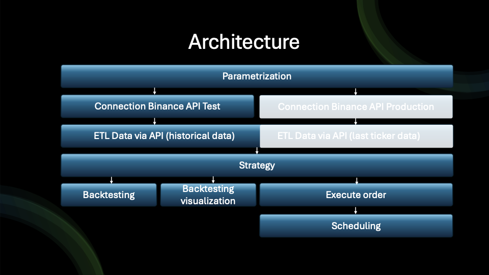

# Python Crypto Trading Bot Binance
This repository contains components to connect to Binance Future Test API, load data, implement a strategy, backtest and execute orders.
The components are:
- Parametrization
- Connection to Binance Test via API
- ETL Data via API
    - converting Investing amount into suitable lots for chosen coin
- Set up Simple strategy
- Backtesting
- Visualisation Backtesting results
- Execute order
- scheduling

## Getting Started
Read https://testnet.binancefuture.com/en/futures/BTCUSDT for more Information
### Installation
Before starting the bot, you need to install some packages.
- Inside of the python_crypto_trading_bot/Script directory, run 'pip3 install -r requirements.txt' to install this project’s dependencies.
- Custom command (venv): python_crypto_trading_bot/bin/pip3 install -r python_crypto_trading_bot/Script/requirements.txt

### High level overview
To get a better overview about the trading crypto bots you see a high level architecture and their dependencies.

#### Parametrization
Before start trading you have to know what, when, how you want to trade. Therefore you can set-up the following parameter:
- Environment (Test/Production)
- Future Coin
- Investment amount
- Time interval
- Time period for backtesting
- 
#### Connection to Binance Test via API
Create and set-up client which connects to Binance Futures API Test. Account required for https://testnet.binancefuture.com/
#### ETL Data via API
Load data from API Test into bot and transform these to your needs.
Requirements are:
- Convert server_time, open_time into human readable time type.
- Filter data
- Set Column names
##### converting Investing amount into suitable lots for chosen coin
- Convert Investment amount into suitable lots
#### Set up Simple strategy
- If SMA(200) is above Closing_Price or RSI < 30 Buy
- If SMA(200) is below Closing_Price or RSI > 70 Sell
#### Backtesting
- Get KPI's
    - Profit/Loss amount per transaction
    - Profit/Loss and fees amount per transaction 
    - Cumulative Profit/Loss
    - Number of transactions
#### Visualisation Backtesting results
- Create diagrams for
    - Closing_price
    - SMA 200
    - RSI
    - Trading Volume
    - Order execution 
#### Exute order
Multiple parameters can be configured, to execute an order. 
Functions to prepare parameters accordingly.
Set parameters depending on strategy.

### Scheduling
Here you can set up the scheduling, to automate trading.